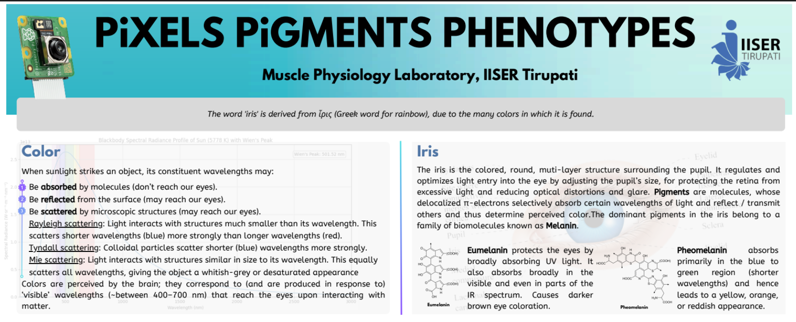
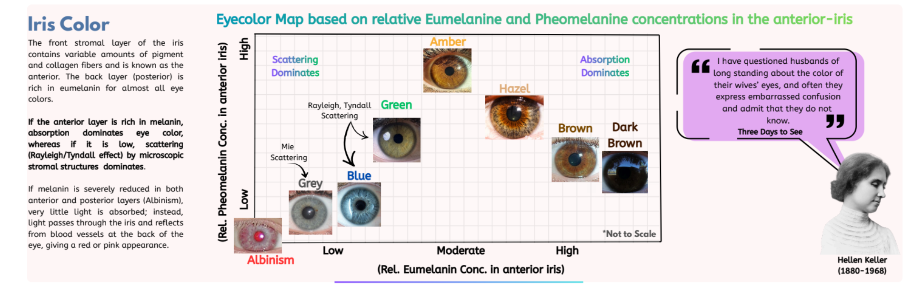
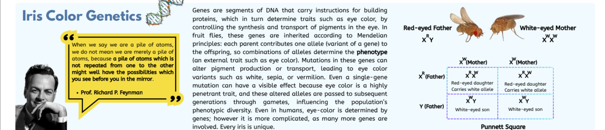
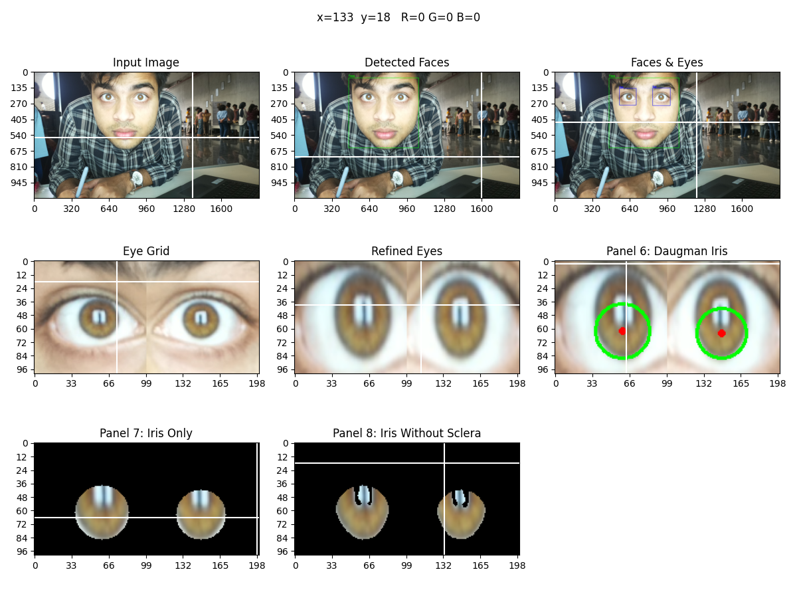
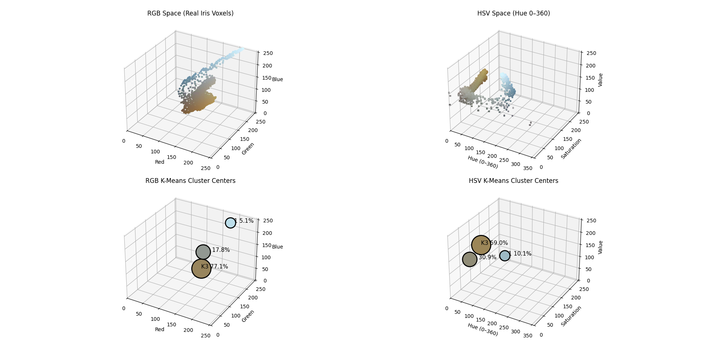
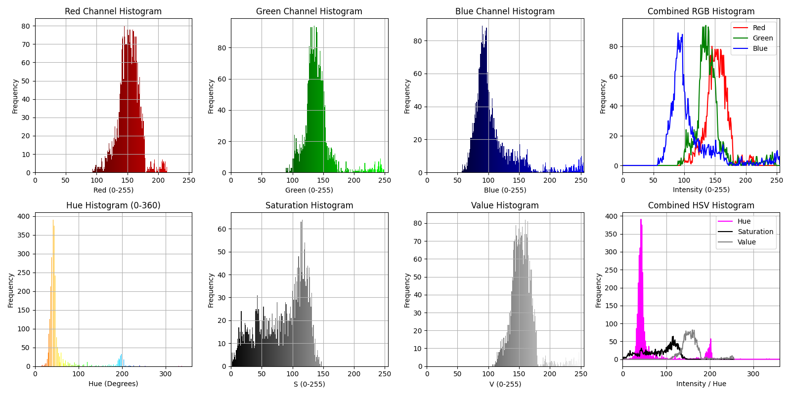
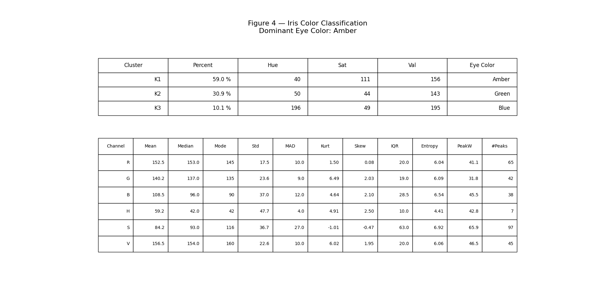

# Iris Color Detection using Raspberry Pi

A Raspberry Pi-based system that captures images via a physical button, transfers them over LAN, and analyzes iris color using computer vision and K-means clustering in HSV space. This Project was demonstrated on National Science Day 2026, at IISER Tirupati, on behalf of the Muscle Physiology Lab.

<p align="center">
  
</p>

<p align="center">
  <em>Introduction</em>
</p>

<p align="center">
  
</p>

<p align="center">
  <em>How relative pigment-abundance determines iris color</em>
</p>

<p align="center">
  
</p>

<p align="center">
  <em>The Underlying Genetics</em>
</p>

---

## Aim

To measure a person’s iris color by extracting iris pixels and determining the **dominant K-means cluster in HSV color space**.

---

## Overview

This project integrates:

- Embedded hardware (Raspberry Pi + Camera + Button)
- Networking (LAN-based file transfer to laptop)
- Computer Vision (OpenCV + Daugman-inspired iris detection)
- Data Analysis (RGB/HSV histograms, clustering, statistics)

The system is designed for **real-time demonstration environments** (e.g., exhibitions), avoiding repeated SD card transfers.

---

## ⚙️ System Workflow

Button → Raspberry Pi → Image Capture → LAN Transfer → Laptop → OpenCV Analysis → Iris Color Output

1. Button press triggers image capture on Raspberry Pi  
2. Image is saved with timestamp  
3. Image is transferred to laptop via shared folder (LAN)  
4. Latest image is selected for processing  
5. Pipeline performs:
   - Face detection
   - Eye detection
   - Iris localization (Daugman-inspired)
   - Iris pixel extraction
   - RGB & HSV analysis
   - K-means clustering (dominant color)

---

## Apparatus

- Raspberry Pi 3B+
- Raspberry Pi Camera Module 3
- Push button + jumper wires
- Breadboard
- LAN cable (Pi ↔ Laptop)
- Power supply (5V, 2.5A)
- Monitor, keyboard, mouse (for setup)
- Windows PC (for processing)

---

## Methodology

### 1. Image Acquisition
- Triggered via GPIO button
- Captured using `libcamera-still`
- Saved with timestamp

### 2. Iris Detection
- Face detection (Haar cascades)
- Eye detection
- Iris localization using **Daugman-inspired circular gradient search**

### 3. Pixel Extraction
- Extract pixels inside iris circle
- Remove sclera using brightness + saturation filtering

### 4. Color Analysis
- RGB histograms
- HSV histograms (more robust to lighting)

### 5. Clustering
- K-means clustering applied to:
  - RGB space
  - HSV space
- Largest cluster = **dominant iris color**

### 6. Classification
- HSV thresholds used to classify:
  - Brown / Dark Brown / Light Brown
  - Blue / Green / Amber / Grey

---

## 📂 Project Structure

```

iris-color-detection-raspberry-pi/
│
├── src/
│   ├── button.py
│   ├── iris_analysis.py
│
├── scripts/
│   └── setup_lan.sh
│
├── results/
│   ├── 0.2026-03-4_15-44-11.jpg
│   ├── 1.Iris_detection.png
│   ├── 2.Clustering.png
│   ├── 3.Histograms.png
│   ├── 4.Summary.png
│   └── 5.Terminal_output.png
│
├── README.md
├── requirements.txt


````

---

## Setup & Execution

### 1. Install Python dependencies
```bash
pip install -r requirements.txt
````

### 2. Install system dependencies (Raspberry Pi)

```bash
sudo apt update
sudo apt install -y cifs-utils network-manager python3-tk
```

### 3. Setup LAN transfer

```bash
bash scripts/setup_lan.sh
```

### 4. Run image capture (on Raspberry Pi)

```bash
python src/button.py
```

### 5. Run analysis (on laptop)

```bash
python src/iris_analysis.py
```

---

## Results

### 📷 Captured Image


### Iris Detection



### K-means Clustering



### Histograms (RGB & HSV)



### Final Output



---

## Observations

* HSV color space provides **better robustness to lighting variations** than RGB
* K-means clustering effectively identifies dominant iris color (mean RGB value needn't reflect dominant eye color)
* Removing sclera and glare significantly improves clustering accuracy

---

## 📎 Notes

* Ensure shared Windows folder is mounted before capture
* Replace IP addresses and credentials in setup script
---

## 📜 License

This project is for educational and experimental purposes.

```
```
