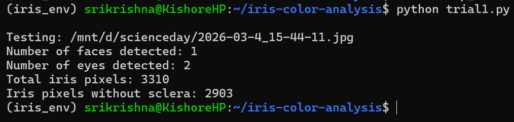

```markdown
# Iris Color Detection using Raspberry Pi

A Raspberry Pi-based system that captures images on button press, transfers them over LAN, and analyzes iris color using computer vision techniques.

---

## Overview

This project uses a Raspberry Pi 3B+ with a camera module to detect and analyze the iris color of visitors.

The system integrates:
- Hardware (Raspberry Pi + button + camera)
- Networking (LAN file transfer to laptop)
- Computer Vision (OpenCV-based analysis)

---

## System Workflow

Button → Raspberry Pi → Image Capture → LAN Transfer → Laptop → OpenCV Analysis → Results

1. Button press triggers image capture (`button.py`)
2. Image is saved with timestamp on Raspberry Pi
3. Image is transferred to laptop via LAN (shared folder)
4. Image is processed (`iris_analysis.py`) to:
   - Detect face and eyes
   - Segment iris region (Daugman-inspired approach)
   - Extract pixel data from iris
   - Analyze color in RGB and HSV space
   - Apply K-means clustering to find dominant iris color

---

## Key Features

- Button-triggered image capture
- Automatic timestamp-based image storage
- LAN-based file transfer from Raspberry Pi to laptop
- Face, eye, and iris detection using OpenCV
- RGB & HSV histogram analysis
- 3D color space visualization
- Dominant iris color detection using K-means clustering

---

## Technologies Used

- Python
- OpenCV
- NumPy
- Matplotlib
- Scikit-learn
- Raspberry Pi 3B+
- Camera Module
- GPIO (gpiozero)

---

## 📂 Project Structure

```

iris-color-detection-raspberry-pi/
│
├── src/
│   ├── button.py
│   ├── iris_analysis.py
│
├── scripts/
│   └── setup_lan.sh
│
├── results/
│   ├── 0.2026-03-4_15-44-11.jpg
│   ├── 1.Iris_detection.png
│   ├── 2.Clustering.png
│   ├── 3.Histograms.png
│   ├── 4.Summary.png
│   └── 5.Terminal_output.png
│
├── README.md
├── requirements.txt

````

---

## How to Run

### 1. Install Python dependencies

```bash
pip install -r requirements.txt
````

---

### 2. Setup LAN connection (Raspberry Pi)

```bash
bash scripts/setup_lan.sh
```

---

### 3. Run image capture (on Raspberry Pi)

```bash
python src/button.py
```
Click Ctr + C once the image is clicked
---

### 4. Run analysis (on laptop)

```bash
python src/iris_analysis.py
```

---

## 🔧 System Dependencies (Raspberry Pi)

Install required system packages:

```bash
sudo apt update
sudo apt install -y cifs-utils network-manager
```

---

## Results

### 📷 Captured Image


### Iris Detection


### 🎯 Dominant Color (K-means Clustering)


### 📈 RGB & HSV Histograms


### 🧾 Final Summary Output


### Terminal Output



---

## Methodology

* Face and eye detection using Haar cascades (OpenCV)
* Iris localization using circular approximation (Daugman-inspired)
* Pixel extraction from iris region
* Color analysis in:

  * RGB space
  * HSV space
* K-means clustering to determine dominant iris color

---
## 📎 Notes

* Ensure Windows shared folder is mounted before running capture
* Update IP addresses and credentials in `setup_lan.sh`
* `gpiozero` is required only when running on Raspberry Pi

---

## 📜 License

This project is for educational and experimental purposes.

```
```

